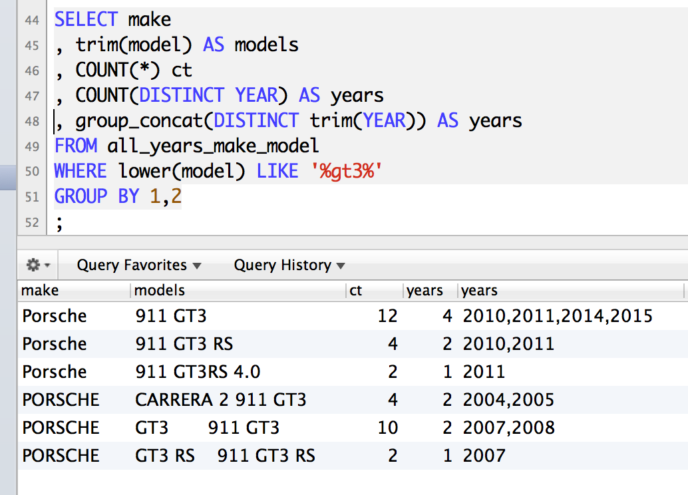

Test Car List Data Files from the EPA
-------------------------------------

SOURCE: This is a set of data from the EPA based on cars tested for emisisons and fuel economy. 

http://www.epa.gov/otaq/tcldata.htm

Below and in the attached SQL files are commands for interacting with the data.

# Getting setup

## Creating and granting db access

Run these commands before trying to add the data.

    $ echo "CREATE DATABASE epa_test_car_data;" | mysql -uroot
    $ echo "CREATE USER '$USER'@'localhost';" | mysql -uroot
    $ echo "GRANT ALL ON epa_test_car_data.* TO '$USER';" | mysql -uroot

## Load this dataset into MySQL.

    $ mysql -u$USER < mysql-tables/epa_test_car_data_2015-03-01.sql

## Enjoy!

# Data prep

Most of the CSVs in this dataset were loaded as is. The earlier files are fixed width, which required a little more work. 

For my current project, I only want year, make, and model, so that's all I attempted to parse here. 

## The early years - fixed width parsing

Parsing the fixed widths years for year, make, model. 

## 1994

        awk '{
            year=substr($0,1,4)
            two=substr($0,5,79)     #4-84
            make=substr($0,84,5)    #84-89 
            four=substr($0,90,76)   #90-166
            model=substr($0,166,25) #166-191
            rest=substr($0,192,230) #192-421
            #printf ("%s|%s|%s|%s|%s|%s\n", year, two, make, four, model,rest)
            printf ("%s|%s|%s\n", year, make, model)
        }' 94MFTCL.TXT > 94mftcl.csv

## 1995

        awk '{
            year=substr($0,1,4)
            two=substr($0,5,79)     #4-84
            make=substr($0,84,5)    #84-89 
            four=substr($0,90,76)   #90-166
            model=substr($0,166,25) #166-191
            rest=substr($0,192,230) #192-421
            #printf ("%s|%s|%s|%s|%s|%s\n", year, two, make, four, model,rest)
            printf ("%s|%s|%s\n", year, make, model)
        }' 95MFTCL.TXT > 95mftcl.csv

## 1996

        awk '{
            year=substr($0,1,4)
            two=substr($0,5,79)     #4-84
            make=substr($0,84,5)    #84-89 
            four=substr($0,90,76)   #90-166
            model=substr($0,166,25) #166-191
            rest=substr($0,192,230) #192-421
            #printf ("%s|%s|%s|%s|%s|%s\n", year, two, make, four, model,rest)
            printf ("%s|%s|%s\n", year, make, model)
        }' 96MFTCL.ASC > 96mftcl.csv

## 1997
        awk '{
            year=substr($0,1,4)
            two=substr($0,5,79)     #4-84
            make=substr($0,84,5)    #84-89 
            four=substr($0,90,76)   #90-166
            model=substr($0,166,25) #166-191
            rest=substr($0,192,230) #192-421
            #printf ("%s|%s|%s|%s|%s|%s\n", year, two, make, four, model,rest)
            printf ("%s|%s|%s\n", year, make, model)
        }' 97MFTCL.DAT > 97mftcl.csv
        
